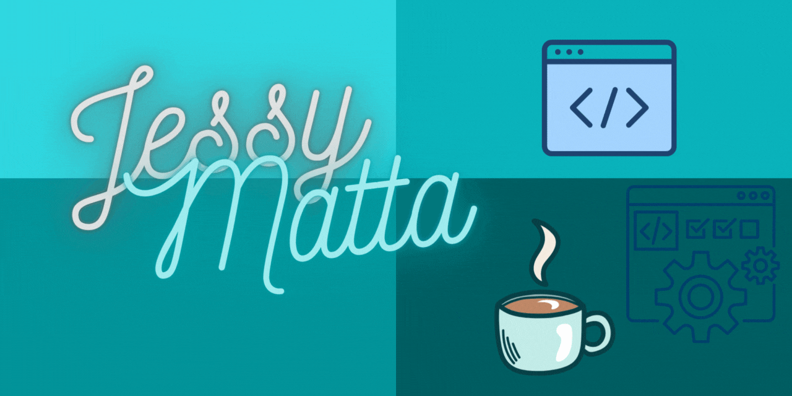

# Hi there 👋, I'm Jessy Matta
I'm a graduate mathematics student and extremely passionate about programming.</h3>

## About me
- 🎲 I have a masters in **Discrete Mathematics and Algebra**
- 📚 I love **learning**
- 🌱 I’m currently learning **Full Stack Web Development**
- 📫 How to reach me **jessy.w.matta@gmail.com**
- ⚡ Fun fact **My github is empty now but hopefully this will change 😊**
 

## Languages and Tools

     

&nbsp;

